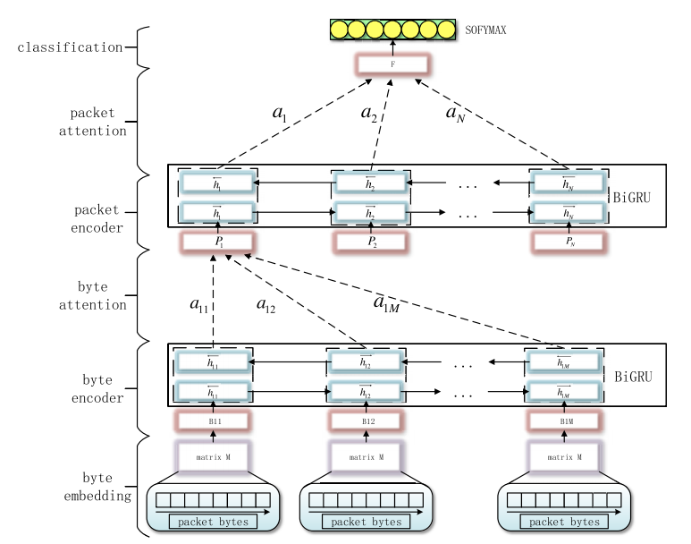

```
TODO : 
날짜별로 공격 패킷이 다름 모든 패킷에 대해 어떻게 학습을 할지?
packet data와 label data의 매칭
packet data에서 flow를 어떻게 추출하는지
```
# Packet-Length-Adjustable Attention Model

> PLA Attention Model [[Paper Link](https://ieeexplore.ieee.org/stamp/stamp.jsp?tp=&arnumber=8744218)]

